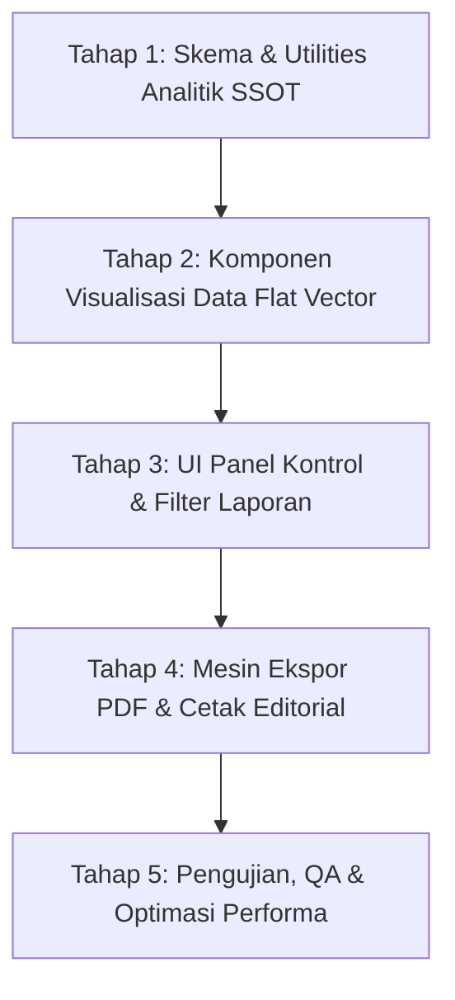

# ROADMAP DEVELOPMENT PLAN: MODUL LAPORAN MULTIDIVISI & MESIN EKSPOR PDF EDITORIAL (OSTIFAK-ODP)

> **Dokumen Perencanaan Kerja & Arsitektur Fitur**  
> **Status:** Draft Rencana Kerja (Menunggu Review & Persetujuan)  
> **Versi:** 1.0.0  
> **Tanggal:** 28 Agustus 2026  

---

## 📌 OVERVIEW & PRINSIP UTAMA (ANTI-GRAVITY PRINT & EDITORIAL ANALYTICS)

Modul **Laporan Multidivisi & Analitik SSOT** dirancang untuk menyediakan visualisasi data, agregasi statistik, serta dokumen cetak laporan resmi bagi 3 ranah operasional utama:
1. **Divisi Tahfizh Al-Qur'an** (Ziyadah, Murojaah, Kelancaran/Fluency, Peak Productivity).
2. **Divisi Keamanan & Kedisiplinan** (Pelanggaran Aktif/Lifetime, Peluruhan/Daily Decay, Kasus Berat/Mahkamah, Tren Disiplin).
3. **Laporan Gabungan / Eksekutif** (Komparasi Rasio PP vs PK, Indeks Kedisiplinan & Prestasi Kolektif Santri).

### 🛡️ Prinsip Desain & Ekspor (Anti-Gravity Print):
- **Strict No-Container & No-Icon Decorative:** Tampilan laporan dan cetakan PDF berada di atas kanvas bersih tanpa kotak kartu bertumpuk atau ikon dekoratif berlebihan.
- **Hairline Divider & High Density:** Menggunakan garis pembatas tipis (`border-b border-[#E2E8F0]`) dan tabel berdensitas tinggi untuk efisiensi ruang baca.
- **Editorial Typography:** Menggunakan hirarki tipografi tegas (Headline Serif/Sans bold, Mono untuk nilai angka/poin, Body Sans legible).
- **Format Dokumen Resmi:** Dilengkapi Kop Resmi Pesantren, Periode Laporan, Matriks Ringkasan, Tabel Detil Data, dan Blok Tanda Tangan Pengesahan Multidivisi.

---

## 🗺️ ROADMAP TAHAP DEMI TAHAP (STEP-BY-STEP WORKFLOW)

---

### TAHAP 1: ARSITEKTUR SKEMA DATA ANALITIK & UTILITIES AGREGASI SSOT
*Fokus: Mengolah data tunggal SSOT santri, setoran hafalan, dan buku saku kedisiplinan menjadi agregat analitik yang presisi berdasarkan rentang waktu.*

#### 1.1 Definisi Tipe Data (`src/types/report.ts`)
- **Preset Rentang Waktu:** `'weekly' | 'monthly' | 'yearly' | 'custom'`.
- **Interface Filter Laporan:**
  - `dateRange`: `{ startDate: string; endDate: string }`
  - `dormitoryId`: `string | 'all'`
  - `classId`: `string | 'all'`
  - `division`: `'tahfizh' | 'keamanan' | 'gabungan'`
- **Interface Analitik Tahfizh (`TahfizhAnalyticsSummary`):**
  - `totalPagesZiyadah`: total halaman hafalan baru pada periode.
  - `totalPagesMurojaah`: total halaman pengulangan pada periode.
  - `ziyadahRatio`: persentase rasio Ziyadah vs Murojaah.
  - `fluencyDistribution`: `{ lancar: number; mutqin: number; perbaikan: number }`
  - `peakProductivityDays`: hari dalam seminggu dengan volume setoran tertinggi.
  - `trendData`: `Array<{ date: string; ziyadahPages: number; murojaahPages: number }>`
- **Interface Analitik Keamanan/Kedisiplinan (`DisciplineAnalyticsSummary`):**
  - `totalActivePK`: total akumulasi PK aktif santri pada periode.
  - `totalLifetimePK`: total akumulasi seluruh PK historis.
  - `totalDecayedPK`: total poin yang berhasil diluruhkan (Daily Decay).
  - `categoryDistribution`: `{ ringan: number; sedang: number; berat: number }`
  - `mahkamahCasesCount`: total kasus yang masuk sidang mahkamah.
  - `trendData`: `Array<{ date: string; newPK: number; resolvedPK: number; activeBalance: number }>`
- **Interface Analitik Laporan Gabungan (`CombinedAnalyticsSummary`):**
  - `totalPP`: total Poin Prestasi aktif.
  - `totalPK`: total Poin Pelanggaran aktif.
  - `ratioPPvsPK`: rasio perbandingan PP terhadap PK kolektif.
  - `disciplineIndex`: indeks skor kedisiplinan pondok (0 - 100%).
  - `topPerformers`: santri dengan rasio PP & Ziyadah tertinggi.

#### 1.2 Pure Utility Analytics Engine (`src/utils/reportAnalytics.ts`)
- `calculateTahfizhAnalytics(students, setoranHistory, filters)`
- `calculateDisciplineAnalytics(students, violationHistory, filters)`
- `calculateCombinedAnalytics(students, setoranHistory, violationHistory, filters)`
- Utility pembantu penanganan rentang tanggal (`parseDateRange`, `getStartOfWeek`, `getStartOfMonth`).

---

### TAHAP 2: KOMPONEN VISUALISASI DATA FLAT MINIMALIS
*Fokus: Mengembangkan komponen visualisasi data vektor monokrom/minimalis tanpa ikon atau efek glossy.*

#### 2.1 Grafik Garis Tren Waktu Vektor Datar (`src/components/reports/FlatTrendLineChart.tsx`)
- Komponen SVG murni (tanpa ketergantungan library eksternal yang berat).
- Mendukung multi-path (misal: Garis Ziyadah vs Garis Murojaah, atau Garis PK Baru vs Garis Decay).
- Fitur: Responsive viewBox, hairline grid lines (`#E2E8F0`), titik data minimalis (`r=3`), dan tooltip hover angka presisi.

#### 2.2 Monokrom Stacked Progress Bar (`src/components/reports/MonochromeStackedBar.tsx`)
- Bar presentase bertumpuk datar untuk rasio kategori (misal: Ziyadah 40% vs Murojaah 60%, atau Pelanggaran Ringan 70% / Sedang 20% / Berat 10%).
- Tanpa rounded berlebihan, menggunakan palet monokrom/emerald-slate yang kontras dan bersih.

#### 2.3 Tabel Densitas Tinggi (`src/components/reports/HighDensityTable.tsx`)
- Baris tabel rapat (`py-2 px-3`), pembatas garis tipis (`border-b border-[#E2E8F0]`).
- Tanpa pembungkus kartu luar (*unboxed layout*), siap untuk tampilan layar maupun hasil cetak.

---

### TAHAP 3: UI PANEL KONTROL & NAVIGASI MODUL LAPORAN
*Fokus: Membangun antarmuka pengguna (`ReportsView.tsx`) sebagai hub utama laporan multidivisi.*

#### 3.1 Header Panel Kontrol Filter
- Selector Divisi (Pill Tabs: **Divisi Tahfizh**, **Divisi Keamanan**, **Laporan Gabungan**).
- Selector Rentang Waktu (Mingguan, Bulanan, Tahunan, Kustom Rentang Tanggal).
- Filter Spesifik: Kamar/Asrama, Kelas, dan Kata Kunci Santri.
- Tombol Aksi Cetak: **"Cetak / Ekspor PDF Editorial"**.

#### 3.2 Tampilan Matriks Ringkasan & Tab Content
- **Tab Tahfizh:** Matriks total halaman, rasio Ziyadah vs Murojaah, Grafik Tren Setoran Harian, Distribusi Kelancaran.
- **Tab Keamanan:** Matriks Active vs Lifetime PK, Efektivitas Peluruhan (Daily Decay), Grafik Tren Pelanggaran, Kasus Mahkamah.
- **Tab Gabungan:** Radar/Rasio Komparasi PP vs PK, Tabel Peringkat Integritas Santri, Ringkasan Eksekutif Operasional.

#### 3.3 Integrasi Navigasi Sistem
- Menambahkan rujukan modul Laporan ke dalam `Sidebar.tsx` dan router aplikasi utama (`App.tsx`).

---

### TAHAP 4: MESIN EKSPOR PDF EDITORIAL & STYLESHEET CETAK (ANTI-GRAVITY PRINT)
*Fokus: Mengembangkan modul pencetakan dokumen resmi berstandar cetak editorial.*

#### 4.1 Modul Generator PDF / Print Layout (`src/components/reports/EditorialReportPrint.tsx`)
- **Struktur Dokumen Cetak Respon A4 (Portrait/Landscape):**
  1. **Header Resmi (Kop Surat):** Logo Pondok, Nama Lembaga, Alamat Resmi, Judul Laporan, dan Periode Data.
  2. **Ringkasan Eksekutif (Executive Summary):** 3-4 kolom metrik tanpa kontainer kartu.
  3. **Visualisasi Vektor Cetak:** Grafik tren vektor monokrom yang dioptimalkan khusus warna tinta hitam/emerald cetak.
  4. **Tabel Data Rapat (Detailed Breakdown):** Daftar santri, akumulasi poin, status disiplin/hafalan dengan densitas baris tinggi.
  5. **Blok Tanda Tangan Pengesahan (Signature Block):** 3 kolom tanda tangan (Kepala Divisi, Sekretaris, dan Pengasuh/Pimpinan Pesantren).

#### 4.2 Stylesheet Cetak (`@media print` / CSS Isolation)
- Menyembunyikan seluruh UI aplikasi (Sidebar, Top Header, Filter Bar, Tombol Aksi) saat dialog cetak aktif.
- Menjamin *page-break-inside: avoid* pada tabel dan blok tanda tangan agar tidak terpotong di batas halaman A4.

---

### TAHAP 5: PENGUJIAN, VERIFIKASI, & OPTIMASI PERFORMA

1. **Uji Validitas Kalkulasi Agregasi SSOT:** Memastikan angka rasio Ziyadah/Murojaah dan Active/Lifetime PK 100% cocok dengan data mentah santri.
2. **Uji Kompatibilitas Tampilan Cetak:** Menguji dialog cetak di Chrome/Firefox/Edge dan ekspor PDF ukuran kertas A4.
3. **Uji Performa Dataset Besar:** Memastikan perhitungan analitik tidak menyebabkan lag pada UI saat menangani puluhan/ratusan santri.
4. **Verifikasi Kompilasi Strict Type Check (`npx tsc --noEmit`):** Memastikan 0 error TypeScript.

---

## 📋 DAFTAR FILE YANG AKAN DIBUAT & DIEDIT

| No | Path File | Status | Deskripsi Tugas |
|---|---|---|---|
| 1 | `REPORT_DEVELOPMENT_PLAN.md` | **Dibuat** | Dokumen rencana kerja terstruktur (file ini) |
| 2 | `src/types/report.ts` | Aka Dibuat | Definisi tipe data analitik, filter, dan struktur laporan |
| 3 | `src/utils/reportAnalytics.ts` | Aka Dibuat | Mesin kalkulator agregasi data SSOT Tahfizh & Keamanan |
| 4 | `src/components/reports/FlatTrendLineChart.tsx` | Aka Dibuat | Komponen grafik garis tren vektor datar minimalis SVG |
| 5 | `src/components/reports/MonochromeStackedBar.tsx` | Aka Dibuat | Komponen progress bar persentase monokrom bertumpuk |
| 6 | `src/components/reports/EditorialReportPrint.tsx` | Aka Dibuat | Layout dokumen cetak editorial A4 & blok tanda tangan |
| 7 | `src/components/views/ReportsView.tsx` | Aka Dibuat | Antarmuka utama panel kontrol laporan & analitik |
| 8 | `src/components/Sidebar.tsx` | Ditambah | Penambahan link menu navigasi Modul Laporan |
| 9 | `src/App.tsx` | Ditambah | Registrasi rute view `reports` pada router utama |

---

## 🎯 LANGKAH SELANJUTNYA (NEXT ACTION)

Saya telah menyelesaikan penyusunan file dokumen rencana kerja `REPORT_DEVELOPMENT_PLAN.md` ini di direktori root proyek.

**Mohon review dokumen rencana kerja di atas.** Setelah Anda menyetujui atau memberikan masukan pada rencana kerja ini, saya siap untuk mulai mengeksekusi pengerjaan dari **Tahap 1 (Arsitektur Skema Data Analitik & Utilities Agregasi SSOT)** secara bertahap.
